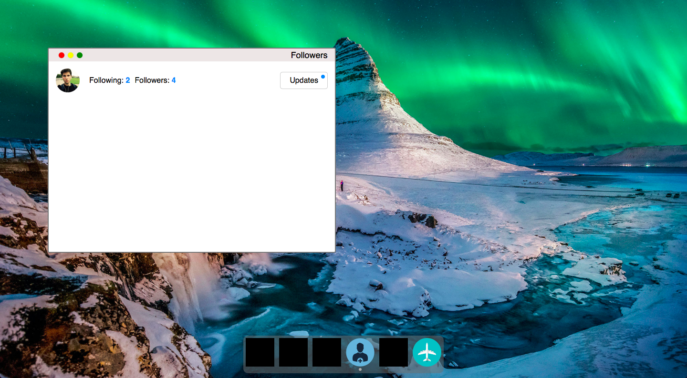

# MacOS-like Desktop on the web 

It's a replica of the desktop and window management experience in macOS. There is a working dock; windows can be opened from the dock, moved around, resized, maximized, and minimized.

There are two working applications:

- Followers, which is a small app to manage friend requests.
- BookFly (work-in-progress), which is an app to find and "buy" airplane tickets.

[Demo version](https://sad-spence-442c98.netlify.com)
